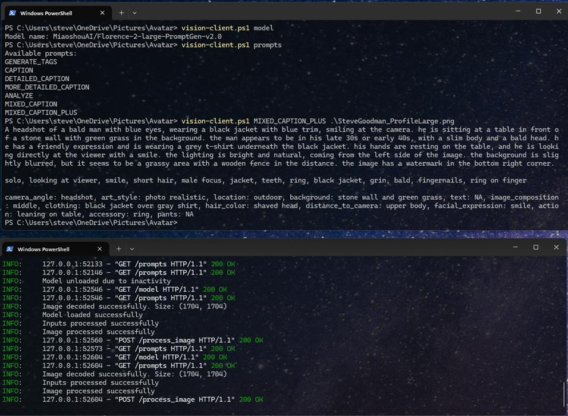

# Florence2 PromptGen 2.0 compatible on-demand API server with command line clients

This project implements a Vision API server for captioning images using **Florence2** (and variants) with fast inference and automatic model unloading when not in use.

## Purpose

This makes it easy to keep the Florence-2 model finetune PromptGen 2.0 running in the background using a single instance that can queue and respond to simple requestsm and unload when not in use. My main purpose for it was to use with an OpenAI vision wrapper to vision-enable some of my local LLMs. I also use it with ComfyUI with a custom node so that I can keep the model on a different GPU or even different machine. Day to day though, it's mainly useful for captioning images for training or when updating EXIF data.




## Model

The server uses the Florence-2 model, by default the fine-tune of Florence-2-base, **Florence-2-large-PromptGen v2.0**, which is a 0.77B fine-tuned for image captioning, and can generate detailed descriptions, analyse images, create tags and more. Read more about this model here: [MiaoshouAI/Florence-2-large-PromptGen-v2.0](https://huggingface.co/MiaoshouAI/Florence-2-base-PromptGen-v2.0). If you are captioning images for training image generation models like Flux.1D, then either this model or [MiaoshouAI/Florence-2-base-PromptGen-v2.0](https://huggingface.co/MiaoshouAI/Florence-2-base-PromptGen-v2.0) (a 0.23B model)

## Server Features

**Asynchronous Processing**: Requests are processed asynchronously, allowing for efficient handling of multiple requests.
**Auto Model Unloading**: The model is automatically unloaded after a period of inactivity (default: 300 seconds), freeing up system resources when not in use.
**Request Queueing**: Incoming requests are queued and processed in order.

The vision-server.py can be ran on Windows or Linux as a service. On Windows, try NSSM. On Debian-like Linux distributions (e.g. Ubuntu) create a Unit file (e.g. systemctl edit vision-server --force --full). On both, use the full path of the python executable in the .venv folder followed by the path to vision-server.py.

It is well suited to use across multiple machines, and as it is stateless, HAProxy (or similar) can be used to distribute requests for fast tagging.

## Installation

1. Clone the repository:

   ```
   git clone <repository-url>
   cd florence2-visionapi
   ```

2. Install the required packages:
   - For Linux: The `vision-server.sh` script will automatically set up a virtual environment and install the required packages when run for the first time.
   - For Windows: The `vision-server.bat` script will set up a virtual environment and install the required packages when run for the first time.

3. Initiate download of the model by attempting to tag an image.

## Starting the Server

### Linux

To start the server on Linux, use the `vision-server.sh` script:

```
./vision-server.sh [--host HOST] [--port PORT]
```

### Windows

To start the server on Windows, use the `vision-server.bat` script:

```
vision-server.bat [--host HOST] [--port PORT]
```

By default, the server will run on `localhost:54880`. You can specify a different host and port using the optional arguments, but you will need to update the command line scripts.

## Examples using Invoke-RestMethod

Requests to the server are straightforward. You can use curl, or on Windows, Invoke-RestMethod to call the model, prompts and image tagging functions. 

Get configured model
`Invoke-RestMethod -Uri "http://localhost:54880/model"`

Get available prompts
`Invoke-RestMethod -Uri "http://localhost:54880/prompts"`

Caption an image
`Invoke-RestMethod -Uri "http://localhost:54880/process_image" -Method Post -Headers @{"Content-Type" = "application/json"} -Body "{""image"": ""$([Convert]::ToBase64String([System.IO.File]::ReadAllBytes("C:\Users\steve\OneDrive\Pictures\Avatar\SteveGoodman_ProfileLarge.png")))"",""prompt"": ""<MIXED_CAPTION_PLUS>""}"`

## Sample Command Line Clients

Both should have identical operations. Update the base_url variable in vision-client.sh/ps1 if you change the host & port the server listens on.

You don't need the command line clients to use this, but they can be helpful if you just want to tag folders of images.


### vision-client.sh and vision-client.ps1

Both the Bash script (requires curl) for Linux and the PowerShell script are designed to work in the same way.

These scripts can be moved as they don't rely on any other files to function, they are simply wrappers for the web requests shown above.

Caption image: `vision-client.sh/vision-client.ps1 <prompt> <image_file_path>`
Example: `vision-client.sh/vision-client.ps1 CAPTION cat.jpg`
Show available prompts: `vision-client.sh/vision-client.ps1 prompts`
Show model name: `vision-client.sh/vision-client.ps1 model`

#### vision-caption-folder-images.sh and vision-caption-folder-images.ps1

As above, these are intended to work in a similar way on Linux or Windows. 

The purpose of the scripts is to recursively caption all images in a folder and save captions to files with the specified extension.tag files in a folder, in preparation for training, or for use with EXIF tagging (for example)

Usage: `vision-caption-folder-images.sh/vision-caption-folder-images.ps1 <prompt> <caption_extension> <folder_path>`
Example: `vision-caption-folder-images.ps1/vision-caption-folder-images.ps1 DETAILED_CAPTION txt C:\path\to\folder`

## Available Prompts for MiaoshouAI/Florence-2-base-PromptGen-v2.0 and MiaoshouAI/Florence-2-large-PromptGen-v2.0

- `GENERATE_TAGS`
- `CAPTION`
- `DETAILED_CAPTION`
- `MORE_DETAILED_CAPTION`
- `ANALYZE`
- `MIXED_CAPTION`
- `MIXED_CAPTION_PLUS`

See the README on Huggingface at [MiaoshouAI/Florence-2-base-PromptGen-v1.5](https://huggingface.co/MiaoshouAI/Florence-2-base-PromptGen-v1.5) for full details of each prompt and expected output.

## API Endpoints

The API server is primarily intended to be used by other services, rather than command line apps.

1. `/prompts` (GET): Returns a list of available prompts.
2. `/process_image` (POST): Processes an image with a given prompt.

Example payload:

`base64_image=$(base64 -w 0 "cat.jpg")`

```json
{
  "image": "$base64_image",
  "prompt": "<CAPTION>"
}
```

Example curl command to post the above
`curl -s -X POST "http://localhost:54880/process_image" -H "Content-Type: application/json" -d @"payload.json"
`

Sample response:

```json
{"result":"a close-up of a cat with a curious expression"}
```

## License

This project is licensed under the MIT License. See the LICENSE file for details.

## Author

Steve Goodman (spgoodman)
